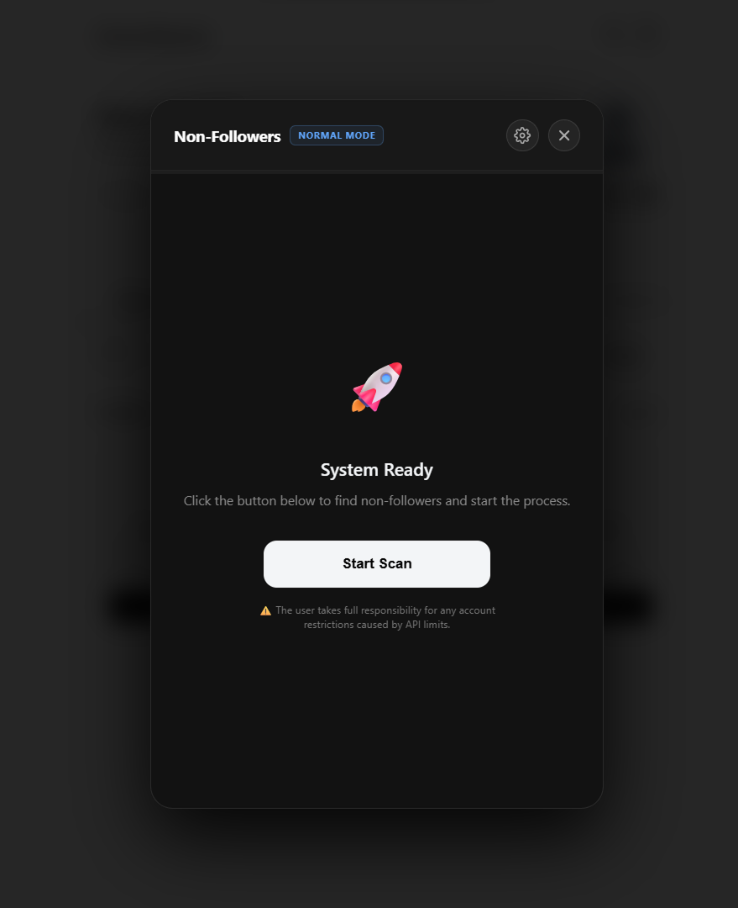
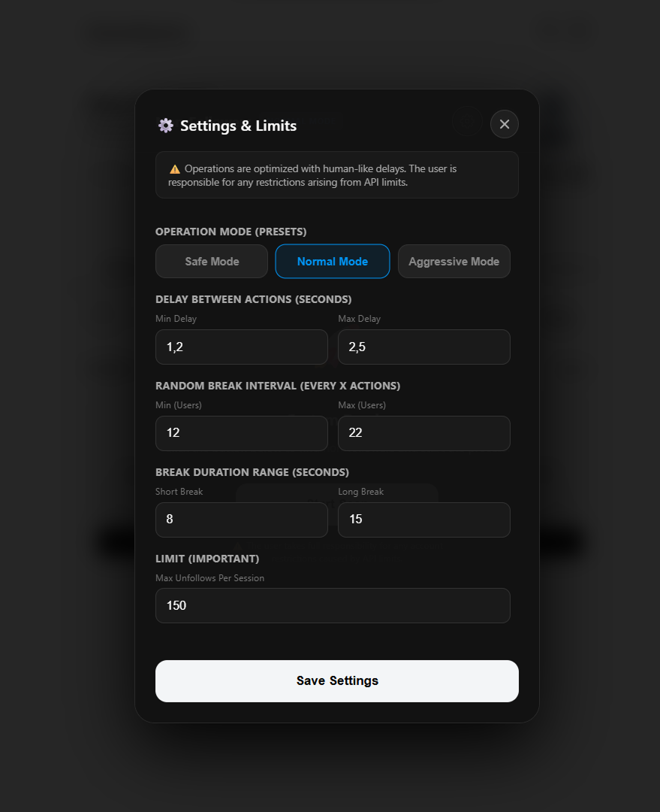
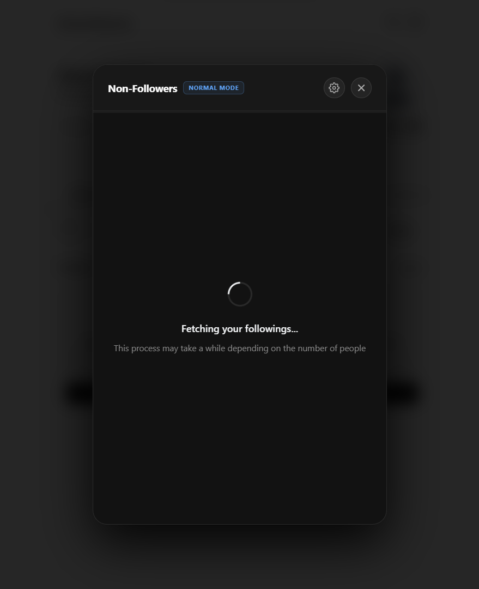
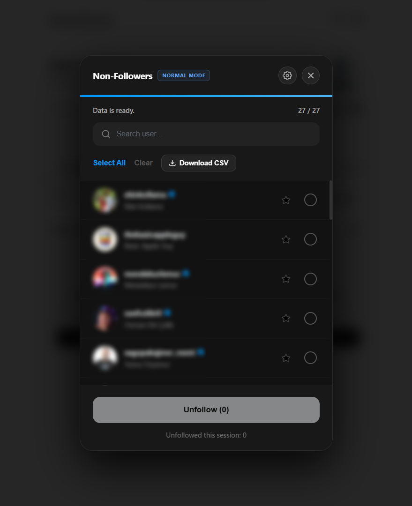
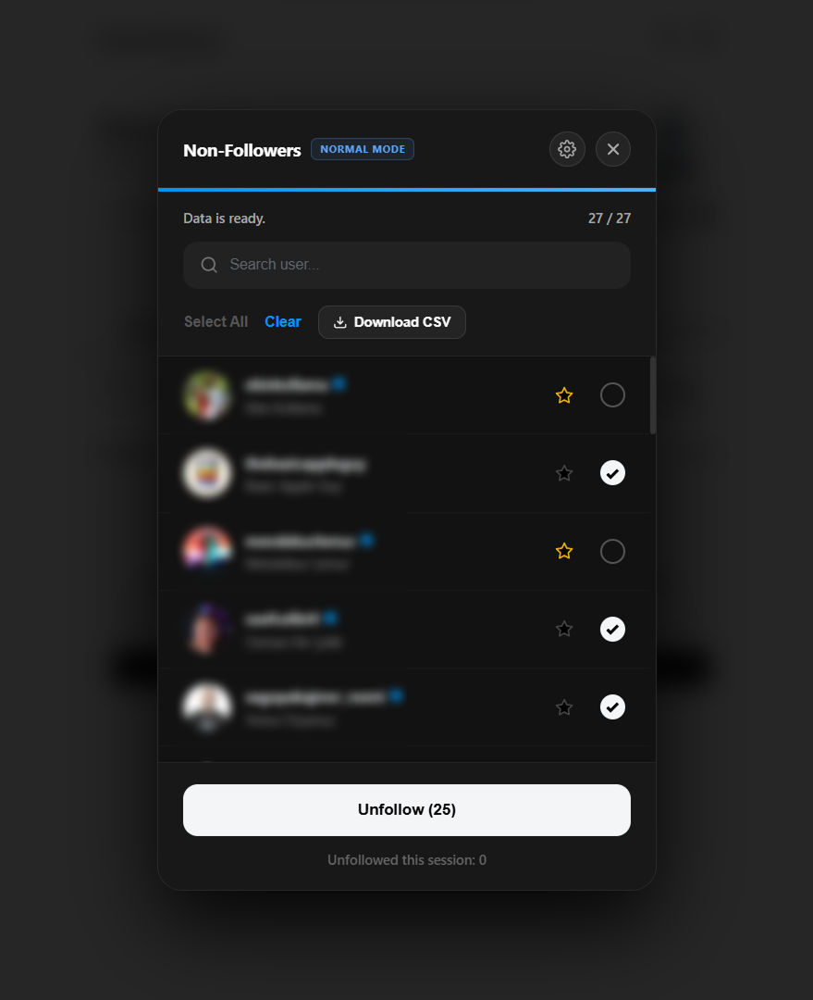
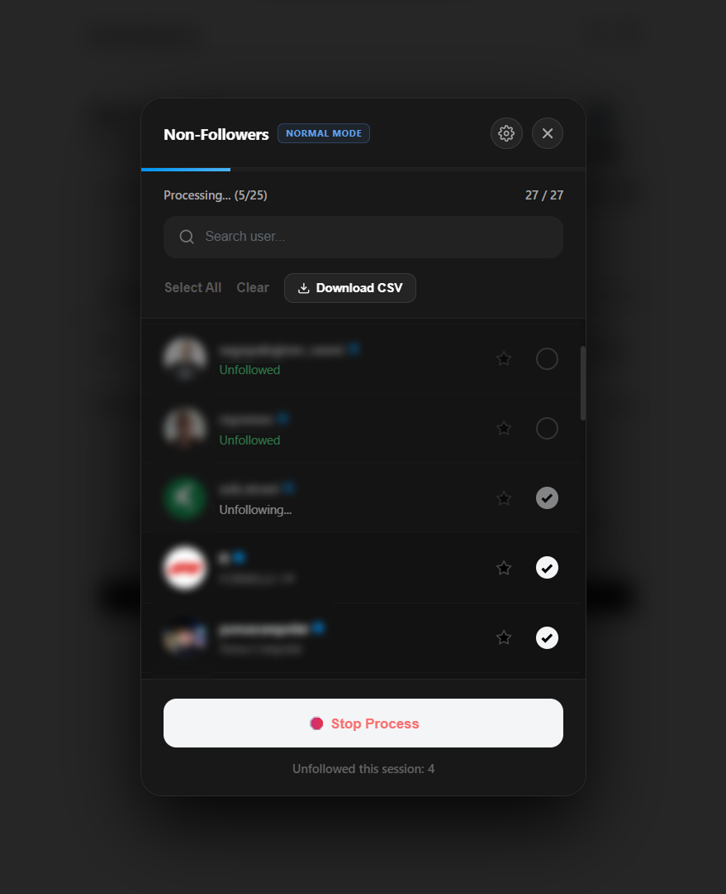
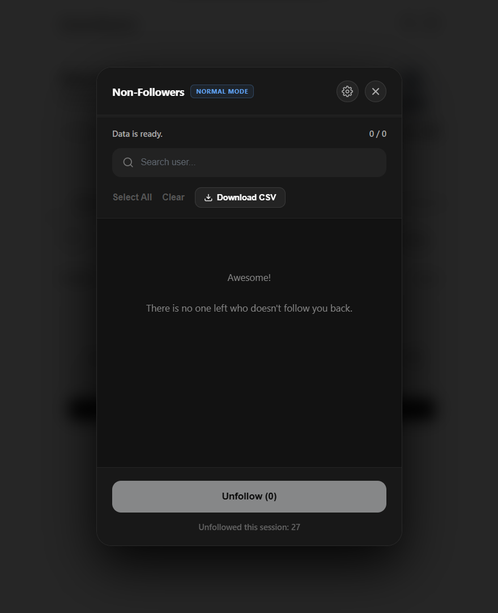

# Threads-Unfollowers

A clean, fast, and open-source script to identify and unfollow users who do not follow you back on Threads.

## 🌐 Web Interface
**[Click here to use the tool](https://timuc7n.github.io/Threads-Unfollowers/)**

## 🖥️ How to use
1. **Visit:** Open the [Web Interface](https://timuc7n.github.io/Threads-Unfollowers/).
2. **Copy:** Click the "Copy" button to get the latest script code.
3. **Execute:** Go to [Threads.com](https://threads.com), open your browser's **Developer Console** (`F12`), paste the code, and press **Enter**.

## 📸 Preview
*Click to enlarge images.*

<table>
  <tr>
    <td></td>
    <td></td>
    <td></td>
  </tr>
  <tr>
    <td></td>
    <td></td>
    <td></td>
  </tr>
  <tr>
    <td></td>
  </tr>
</table>

## ⚠️ Disclaimer
This project is for educational purposes only. Use it at your own risk. Excessive use might lead to temporary limitations or bans on your account. We are not affiliated with Meta or Threads.

## 📄 License
This project is licensed under the MIT License.
